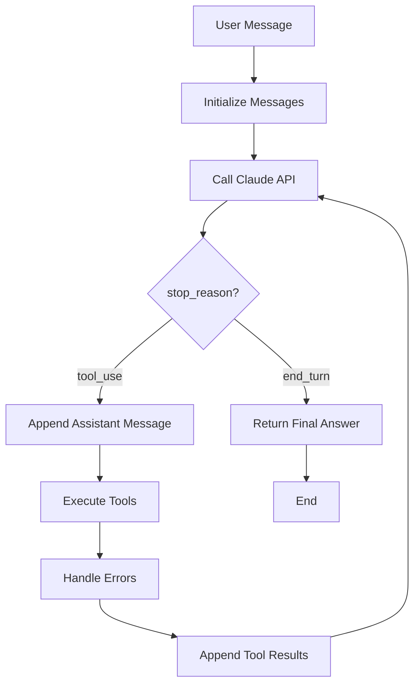

# Scenario 1: Customer Support Resolution Agent

## Overview

This scenario implements a customer support resolution agent using the Claude Agent SDK. The agent handles high-ambiguity requests such as returns, billing disputes, and account issues. It integrates with backend systems through custom Model Context Protocol (MCP) tools including `get_customer`, `lookup_order`, `process_refund`, and `escalate_to_human`.

**Target:** Achieve 80%+ first-contact resolution while intelligently escalating complex cases.

**Primary Exam Domains Covered:**
- **Domain 1: Agentic Architecture & Orchestration** (~25%)
- **Domain 2: Tool Design & MCP Integration** (~20%)
- **Domain 5: Context Management & Reliability** (~15%)

## Implementation

The core implementation is in [`agent.py`](../agent.py), which demonstrates:
- Agentic loop with proper stop conditions
- Tool orchestration and error handling
- Context management through message history
- Escalation patterns for reliability

### Key Components

1. **Agentic Loop**: Continuous iteration until `stop_reason == "end_turn"`
2. **Tool Integration**: Mock implementations of MCP tools with structured error responses
3. **Error Handling**: Categorized errors (transient, permission, validation, internal)
4. **Context Management**: Progressive message history without bloat

## Agentic Loop Workflow

The agent follows a structured loop pattern:



### Workflow Explanation

1. **Initialization**: Start with user's message in conversation history
2. **API Call**: Send current messages + tools to Claude
3. **Decision Point**:
   - If `end_turn`: Extract and return final text response
   - If `tool_use`: Claude requests tool execution
4. **Tool Execution**: Run requested tools with error handling
5. **Result Integration**: Append tool results as "user" role messages
6. **Loop**: Continue until resolution or safety valve triggers

## Three Anti-patterns for Agentic Systems

Based on the Claude Certified Architect exam domains, here are three critical anti-patterns to avoid:

### 1. **Context Bloat (Domain 5: Context Management & Reliability)**
**Problem:** Accumulating excessive context across iterations, leading to degraded performance and hallucinations.

**Symptoms:**
- Messages array grows indefinitely
- Claude starts giving irrelevant responses
- Token limits exceeded prematurely

**Prevention:**
- Implement progressive summarization
- Use context windows strategically
- Clear irrelevant history after resolution

**Example (Bad):**
```python
# Anti-pattern: Never clearing old messages
messages.append({"role": "assistant", "content": response.content})
messages.append({"role": "user", "content": tool_results})
# Messages keep growing...
```

**Example (Good):**
```python
# Summarize after N iterations
if len(messages) > 10:
    summary = summarize_conversation(messages)
    messages = [{"role": "system", "content": summary}]
```

### 2. **Tool Overload (Domain 2: Tool Design & MCP Integration)**
**Problem:** Providing too many tools or poorly described tools, causing Claude to make suboptimal choices.

**Symptoms:**
- Claude calls wrong tools for tasks
- Inefficient tool usage patterns
- Confusion in tool selection

**Prevention:**
- Limit tools to essential functions (5-7 max)
- Write clear, specific descriptions
- Use tool schemas with proper validation

**Example (Bad):**
```python
tools = [
    {"name": "do_everything", "description": "Handles all customer operations"},
    # 20+ tools with vague descriptions
]
```

**Example (Good):**
```python
tools = [
    {
        "name": "lookup_order",
        "description": "Look up an order by its order ID. Returns current status, estimated delivery date, and carrier name. Use this when the customer asks where their order is or when it will arrive.",
        "input_schema": {...}
    }
]
```

### 3. **Infinite Loop Without Exit (Domain 1: Agentic Architecture & Orchestration)**
**Problem:** Agent loops indefinitely without reaching `end_turn`, consuming resources and failing to resolve.

**Symptoms:**
- Agent never returns an answer
- Hits MAX_ITERATIONS safety valve
- Continuous tool calls without progress

**Prevention:**
- Implement clear stop conditions
- Use iteration limits with meaningful caps
- Design tools to provide definitive answers

**Example (Bad):**
```python
while True:  # No exit condition
    response = client.messages.create(...)
    if response.stop_reason == "tool_use":
        # Always calls tools, never ends
```

**Example (Good):**
```python
MAX_ITERATIONS = 50
iteration = 0
while iteration < MAX_ITERATIONS:
    iteration += 1
    response = client.messages.create(...)
    if response.stop_reason == "end_turn":
        return response.content[0].text
    # Handle tool_use...
```

## Code Examples from agent.py

### Tool Definition with Error Handling
```python
def handle_tool_call(tool_name: str, tool_id: str, tool_input: dict) -> dict:
    try:
        content = execute_tool(tool_name, tool_input)
        return {
            "type": "tool_result",
            "tool_use_id": tool_id,
            "content": content,
        }
    except Exception as e:
        return {
            "type": "tool_result",
            "tool_use_id": tool_id,
            "is_error": True,
            "content": json.dumps({
                "errorCategory": "internal",
                "isRetryable": False,
                "description": f"Unexpected error: {str(e)}",
            }),
        }
```

### Agentic Loop Implementation
```python
def run_agent(user_message: str) -> str:
    messages = [{"role": "user", "content": user_message}]
    iteration = 0
    MAX_ITERATIONS = 50
    
    while iteration < MAX_ITERATIONS:
        iteration += 1
        response = client.messages.create(
            model="claude-haiku-4-5",
            max_tokens=4096,
            tools=tools,
            messages=messages
        )
        
        if response.stop_reason == "end_turn":
            return response.content[0].text
        
        if response.stop_reason == "tool_use":
            messages.append({"role": "assistant", "content": response.content})
            tool_results = []
            for block in response.content:
                if block.type == "tool_use":
                    tool_results.append(handle_tool_call(block.name, block.id, block.input))
            messages.append({"role": "user", "content": tool_results})
    
    return "Error: agent did not complete within iteration limit"
```

## Key Takeaways

1. **Agentic Architecture**: Design loops with clear exit conditions and safety valves
2. **Tool Design**: Create focused, well-described tools with robust error handling
3. **Context Management**: Prevent bloat through summarization and strategic positioning
4. **Reliability**: Implement escalation patterns and error categorization

## Running the Example

```bash
# Set API key
export ANTHROPIC_API_KEY="your_key_here"

# Run the agent
python agent.py
```

Expected output demonstrates tool orchestration and final resolution.

---

**Scenario 1 Complete** | *Prepared for Claude Certified Architect Exam* | *May 8, 2026*</content>
<parameter name="filePath">d:\claude-certified-architect\scenario-1-customer-support.md